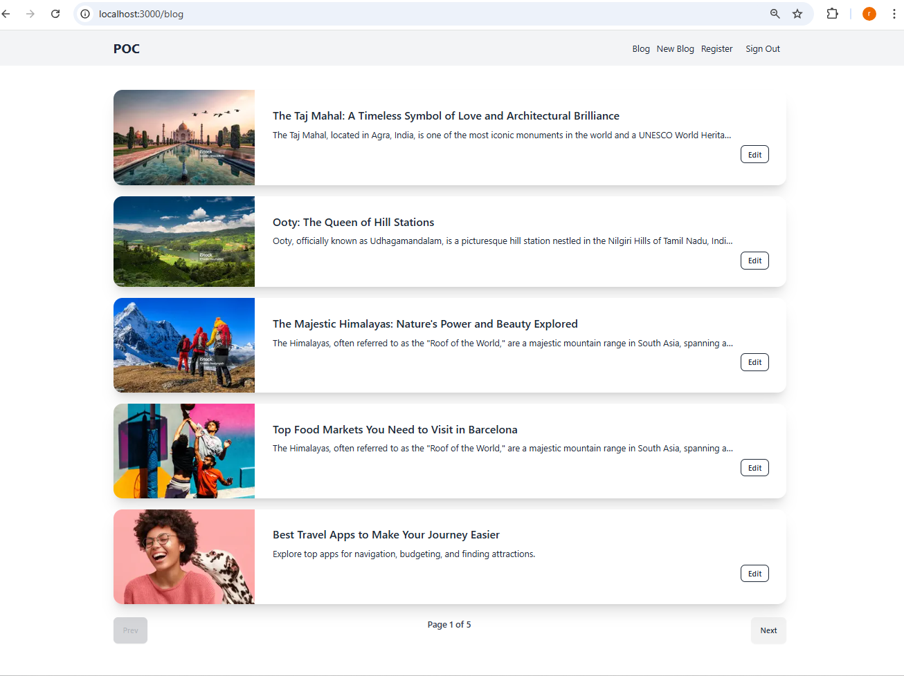
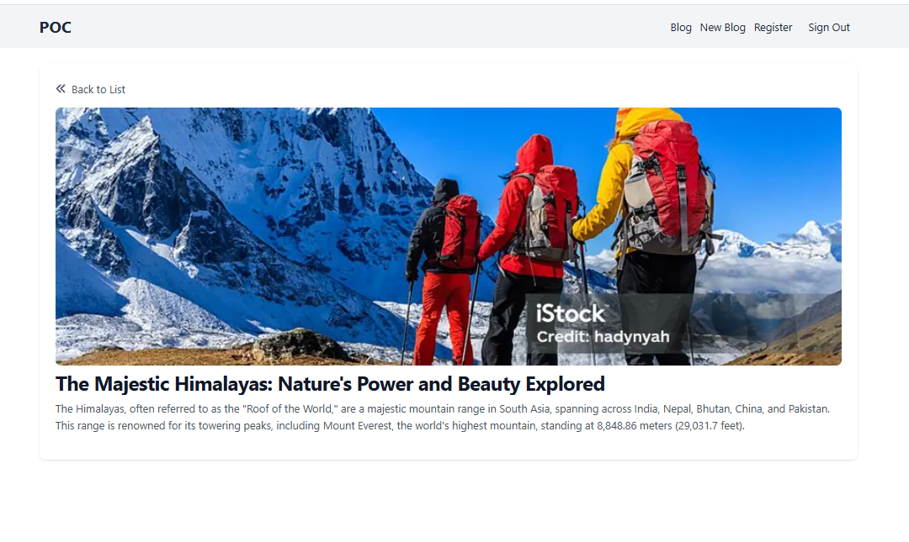
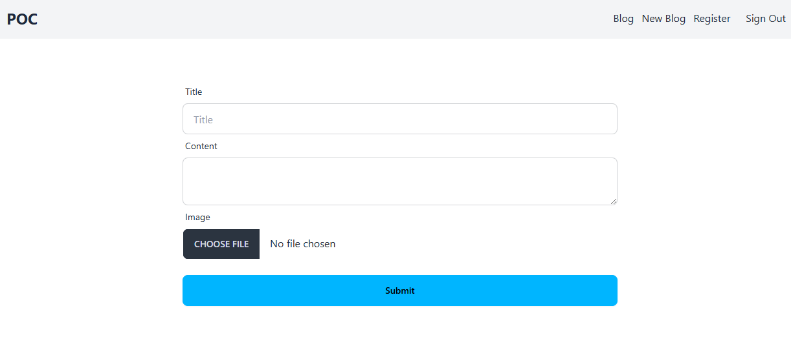

# PERNStackNextjsApp
---

### Project Description:

This is a Proof of Concept (POC) of a basic blog application designed to showcase the integration of modern web technologies. The **frontend** is developed using **Next.js 15**, utilizing **Tailwind CSS** for building a responsive and stylish user interface. The **backend** is built with **Node.js** and **Express.js**, providing a robust API for managing blog posts and user interactions. **PostgreSQL** is used as the database to store the blog content, ensuring scalability and reliability. Additionally, images are uploaded and managed via **Cloudinary CDN**, enabling efficient and secure image hosting.

### Screens
---

